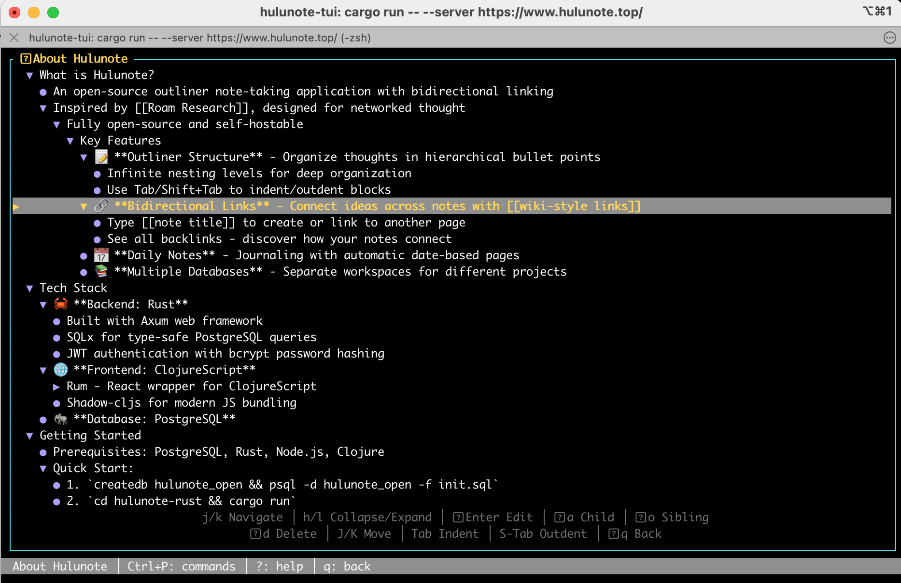
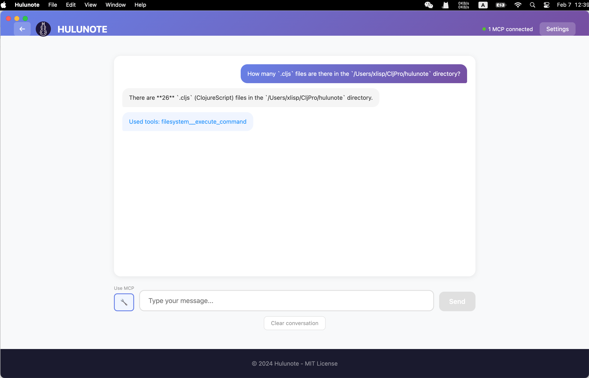
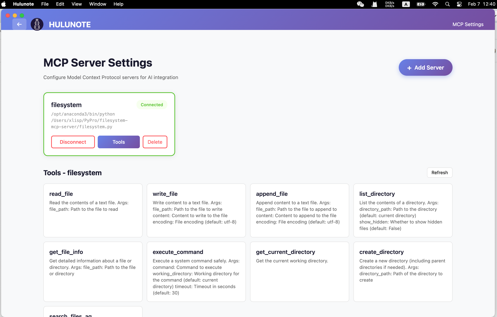

# Hulunote

Hulunote is an open-source outliner note-taking application with bidirectional linking.

Inspired by Roam Research, designed for networked thought.


## Features

- **Outliner Structure** — Organize thoughts in hierarchical bullet points with infinite nesting
- **Bidirectional Links** — Connect ideas with `[[wiki-style links]]` and backlinks
- **Daily Notes** — Journaling with automatic date-based pages
- **Multiple Databases** — Separate workspaces for different projects
- **MCP Client** — Experimental MCP client integration

## Quick Start

```bash
# Start the frontend dev server
npx shadow-cljs watch hulunote

# Build a packaged Electron distributable
npx shadow-cljs release hulunote

# Run the Electron app in dev mode
cd electron && npm run start:dev
```

**Test Account (for local/dev use):** `chanshunli@gmail.com` / `123456`

## Configuration

- **Backend API Base URL (dev):** configured via `:closure-defines` in `shadow-cljs.edn` (`hulunote.http/API_BASE_URL`).

## Screenshots

TUI:


MCP client:



## Repositories

- Frontend (this repo): https://github.com/hulunote/hulunote
- Backend: https://github.com/hulunote/hulunote-rust
- TUI: https://github.com/hulunote/hulunote-tui
- App: https://github.com/hulunote/hulunote-app
- Android: https://github.com/hulunote/hulunote-android
- IOS: https://github.com/hulunote/hulunote-ios

## Contributing

See `CONTRIBUTING.md`.

## License

This project is licensed under the MIT License - see the [LICENSE](LICENSE) file for details.

