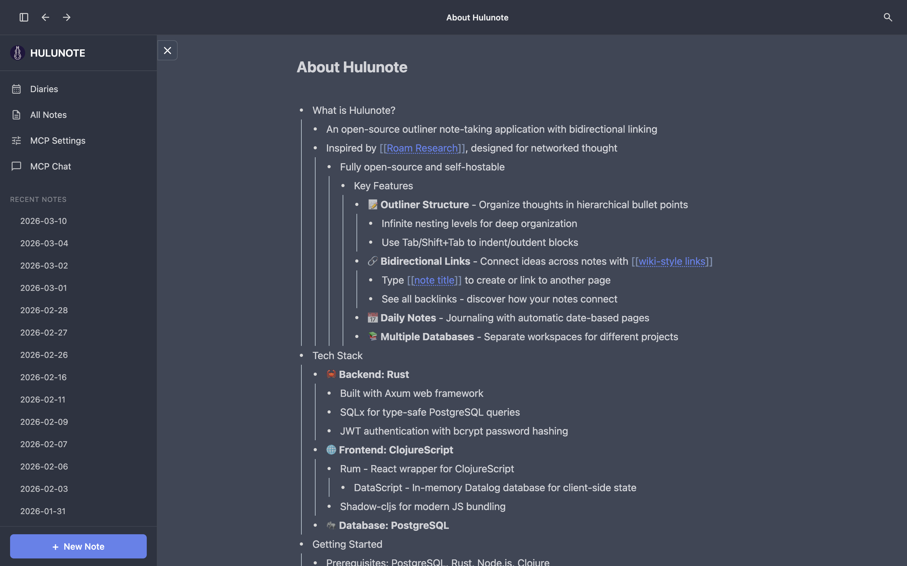

# Hulunote

An open-source outliner note-taking application with bidirectional linking.

Inspired by Roam Research, designed for networked thought.




## Features

- **Outliner Structure** - Organize thoughts in hierarchical bullet points with infinite nesting
- **Bidirectional Links** - Connect ideas with `[[wiki-style links]]` and backlinks
- **Daily Notes** - Journaling with automatic date-based pages
- **Multiple Databases** - Separate workspaces for different projects

## Tech Stack

| Component | Technology |
|-----------|------------|
| Backend | Rust (Axum, SQLx) |
| Frontend | ClojureScript (Rum, DataScript, Shadow-cljs) |
| Database | PostgreSQL |

## Quick Start

```bash
# 1. Initialize database
createdb hulunote_open
psql -d hulunote_open -f hulunote-rust/init.sql

# 2. Start backend
cd hulunote-rust
cargo run

# 3. Start frontend
cd hulunote
yarn
shadow-cljs watch hulunote

# 4. Open browser
open http://localhost:6689
```

**Test Account:** `chanshunli@gmail.com` / `123456`

## Links

- Frontend: https://github.com/hulunote/hulunote
- Backend: https://github.com/hulunote/hulunote-rust
- TUI: https://github.com/hulunote/hulunote-tui

## License

MIT
