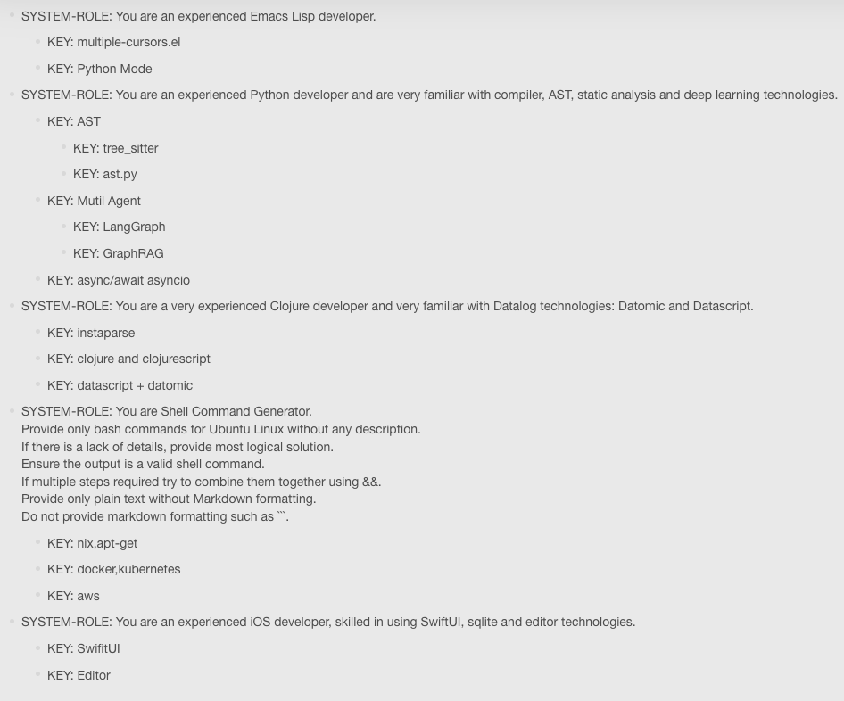

# Hulunote: Powerful prompt engineering development platform


 
## Feature
* Datalog help LLM Prompt Engineering, to achieve explainability of AI
* Use datomic/datascript or cozodb
* Hippocampus for AI, with Embedded Datalog
* Embedding datalog knowledge into LLM enhances LLM's logical reasoning capabilities
* Build powerful prompt database(datomic db) from https://github.com/xlisp/prompt-engineering-design

## technical framework

* clojure and clojurescript
* datascript + rum
* instaparse
* ring
* clj-http
* re-frame

## develop

* Missing dependency
```
$ lein localrepo install jsr173-ri-1.0.jar com.bea.xml/jsr173-ri 1.0

```
* db environment
```bash

> psql
CREATE DATABASE functor_api;

$  psql -d functor_api -Upostgres < ./sql/init.sql
$  for sql in `find . -name "*.sql" | grep -v init.sql | sort `; do psql -d functor_api -Upostgres < $sql ; done

```
* backend
```bash
$ cp config/config.clj.default config/config.clj

$ clojure -A:cider:run
```
* frontend
```bash
$ yarn 

$ clojure -A:cider:cljs:shadow watch hulunote
```

