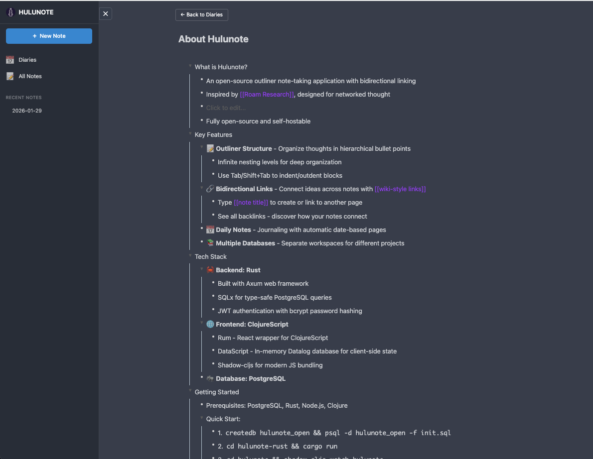
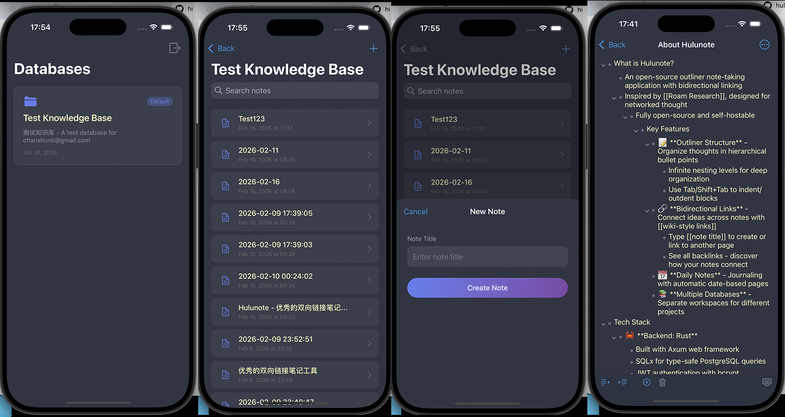
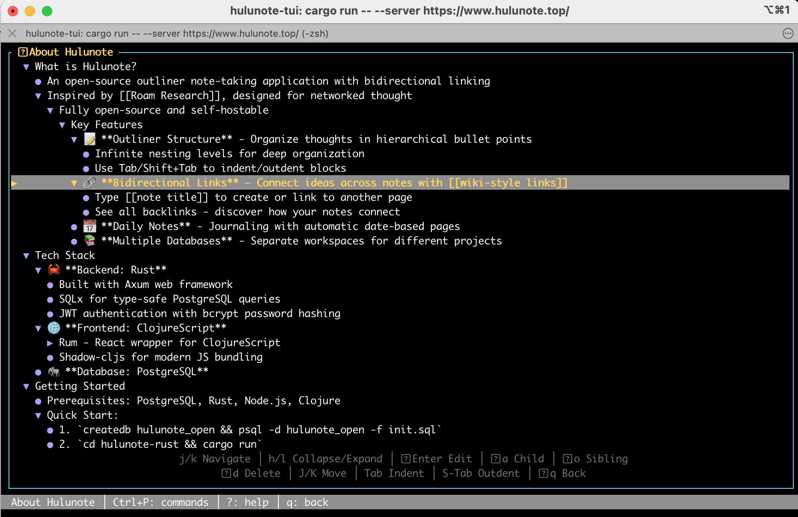
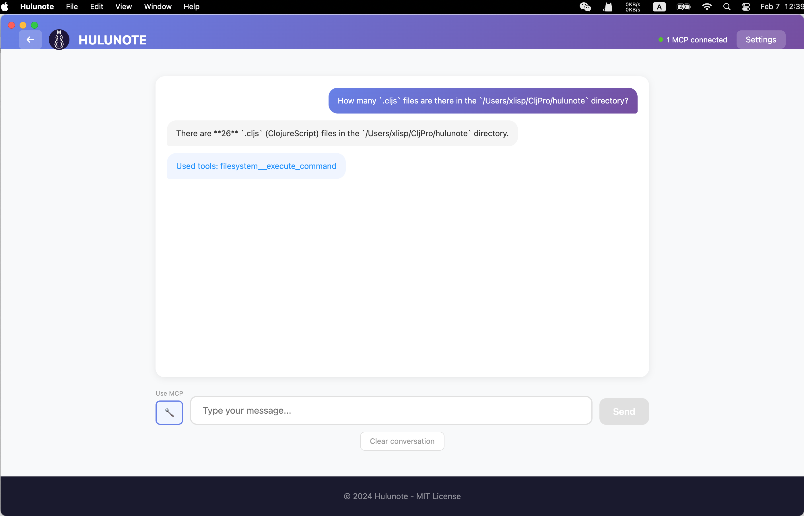
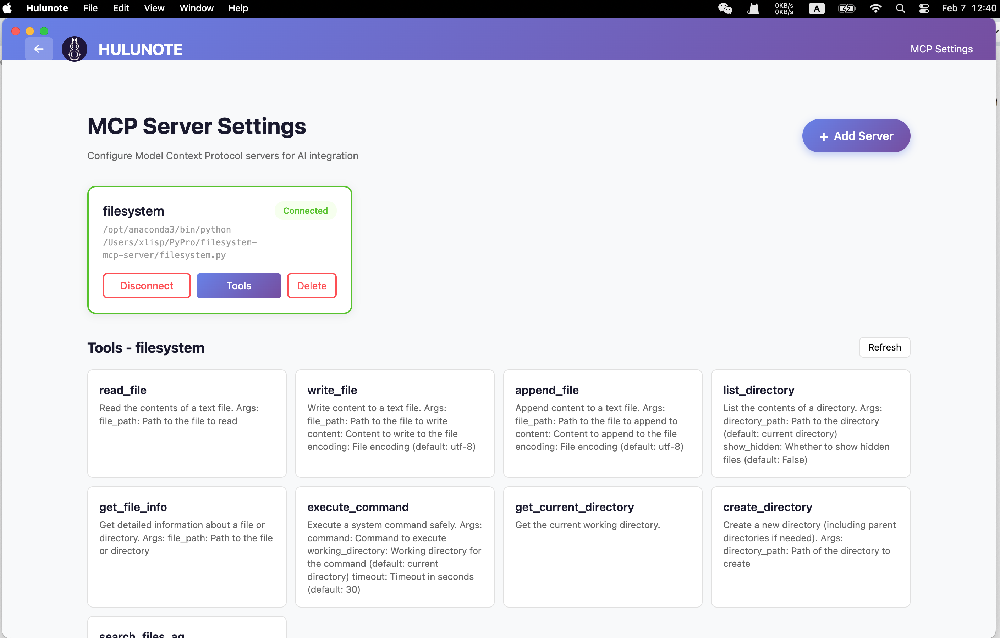

# Hulunote

**AI + Note Hippocampus** — Your second brain, powered by AI.

Hulunote is an open-source outliner note-taking application with bidirectional linking. Inspired by Roam Research, designed for networked thought. Like the hippocampus organizes memories in the brain, Hulunote organizes your knowledge — and now AI helps you build, connect, and retrieve it.




## Features

- **Outliner Structure** — Organize thoughts in hierarchical bullet points with infinite nesting
- **Bidirectional Links** — Connect ideas with `[[wiki-style links]]` and backlinks
- **Daily Notes** — Journaling with automatic date-based pages
- **Multiple Databases** — Separate workspaces for different projects
- **Built-in MCP Client** — Connect to AI models and MCP servers directly from the app
- **AI Note Generation** — Let AI organize, summarize, and generate notes for you

## AI Integration

Hulunote embraces the **AI + Note Hippocampus** philosophy: AI acts as your cognitive co-pilot, helping you capture, organize, and retrieve knowledge just like the hippocampus does for memory.

### MCP Server — For Claude Desktop & MCP Clients

[hulunote-mcp-server](https://github.com/hulunote/hulunote-mcp-server) lets any MCP-compatible client (Claude Desktop, etc.) read and write your Hulunote notes via natural language:

```bash
pip install -r requirements.txt
python hulunote_mcp.py
```

```
"List my databases" → "Create a note about quantum computing" → "Add outline nodes with key concepts"
```

### OpenClaw Plugin — For AI Agents

[openclaw-hulunote-assistant](https://github.com/hulunote/openclaw-hulunote-assistant) brings Hulunote into the OpenClaw AI agent platform, enabling autonomous note management:

```bash
openclaw plugins install --link /path/to/openclaw-hulunote-assistant
```

AI agents can browse databases, create notes, manage outlines, search across your knowledge base, and auto-organize information — all through natural conversation.

### What AI + Hulunote Can Do

- **Auto-organize research** — AI reads sources and creates structured notes with bidirectional links
- **Knowledge summarization** — Condense long documents into concise outline nodes
- **Smart Q&A** — Ask questions about your notes, get answers with references
- **Note generation** — Describe a topic, AI creates a full note with hierarchical outline
- **Cross-database search** — AI finds and connects related ideas across all your databases

## Quick Start

```bash
# 1. Initialize database
createdb hulunote_open
psql -d hulunote_open -f hulunote-rust/init.sql

# 2. Start backend
cd hulunote-rust && cargo run

# 3. Start frontend dev server
cd hulunote && yarn && npx shadow-cljs watch hulunote

# 4. Open browser at http://localhost:6689
```

**Test Account (for local/dev use):** `chanshunli@gmail.com` / `123456`

## Configuration

- **Backend API Base URL (dev):** configured via `:closure-defines` in `shadow-cljs.edn` (`hulunote.http/API_BASE_URL`).

## Screenshots

TUI:


MCP client:



## Repositories

| Repository | Description |
|------------|-------------|
| [hulunote](https://github.com/hulunote/hulunote) | Frontend (this repo) |
| [hulunote-rust](https://github.com/hulunote/hulunote-rust) | Backend (Rust) |
| [hulunote-mcp-server](https://github.com/hulunote/hulunote-mcp-server) | MCP Server for Claude Desktop & MCP clients |
| [openclaw-hulunote-assistant](https://github.com/hulunote/openclaw-hulunote-assistant) | OpenClaw AI agent plugin |
| [hulunote-tui](https://github.com/hulunote/hulunote-tui) | Terminal UI |
| [hulunote-app](https://github.com/hulunote/hulunote-app) | Desktop App (Electron) |
| [hulunote-android](https://github.com/hulunote/hulunote-android) | Android |
| [hulunote-ios](https://github.com/hulunote/hulunote-ios) | iOS |

## Contributing

See `CONTRIBUTING.md`.

## License

This project is licensed under the MIT License - see the [LICENSE](LICENSE) file for details.

